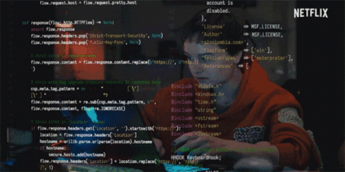

# FreeRTOS Project: STM32 UART Communication and Task Scheduling

## Project Overview

This project demonstrates the use of FreeRTOS on an STM32 microcontroller STM32-F407 Discovery, including the creation of multiple tasks for UART communication. Each task sends a specific message over UART to the host and toggles a GPIO pin to show task activity. The project involves three tasks:

1. **Default Task**: Sends a "hello from default task" message via UART every 100 ms.
2. **Task 2**: Sends a "hello from task 2" message via UART every 500 ms.
3. **Task 3**: Sends a "hello from task 3" message via UART every 1000 ms.

The project also uses GPIO pins to signal the activity of each task.

## Features

- FreeRTOS task management
- UART communication (USART1 and USART2)
- GPIO pin control for task activity indication
- USB device initialization

## Requirements

- STM32 microcontroller (e.g., STM32F4 series)
- STM32CubeMX or STM32CubeIDE for configuration and project generation
- FreeRTOS library included in the STM32CubeMX/STM32CubeIDE configuration

## Key Functions

### `main.c`
- **Initialization**: Initializes the UART peripherals, GPIO pins, and FreeRTOS kernel.
- **FreeRTOS Threads**:
  - `StartDefaultTask()`: Sends a "hello from default task" message every 100 ms and toggles GPIO pin 12.
  - `task2_init()`: Sends a "hello from task 2" message every 500 ms and toggles GPIO pin 14.
  - `task3_init()`: Sends a "hello from task 3" message every 1000 ms and toggles GPIO pin 15.

### UART Communication Functions
- **`HAL_UART_Transmit()`**: Sends data over UART (USART1).
- **`send_deftask()`**: Sends a message from the default task.
- **`send_task2()`**: Sends a message from task 2.
- **`send_task3()`**: Sends a message from task 3.

### GPIO Initialization
- **`MX_GPIO_Init()`**: Configures GPIO pins (e.g., pin 12-15) as output for task indication.

### System Configuration
- **`SystemClock_Config()`**: Configures the system clock to use an HSE oscillator and PLL.
- **`MX_USART1_UART_Init()`**: Initializes UART1 with a baud rate of 115200.
- **`MX_USART2_UART_Init()`**: Initializes UART2 with a baud rate of 115200.

## FreeRTOS Configuration

The project uses FreeRTOS with the following task configurations:

1. **Default Task**: 
   - Task Priority: Normal
   - Stack Size: 128 bytes
   - Period: 100 ms

2. **Task 2**:
   - Task Priority: Normal
   - Stack Size: 128 bytes
   - Period: 500 ms

3. **Task 3**:
   - Task Priority: Normal
   - Stack Size: 128 bytes
   - Period: 1000 ms

### FreeRTOS Scheduler
- The scheduler is started with `osKernelStart()`.

## GPIO Pins
- **GPIO Pin 12**: Toggled by the default task.
- **GPIO Pin 14**: Toggled by task 2.
- **GPIO Pin 15**: Toggled by task 3.

## How to Use

1. **Build the project**: Use STM32CubeIDE or STM32CubeMX to generate and build the project.
2. **Flash the microcontroller**: Flash the generated binary to your STM32 microcontroller.
3. **Monitor UART Output**: Connect the microcontroller's USART1 TX pin to a serial terminal or debugger to view the output.

## Debugging and Error Handling

- The project includes an `Error_Handler()` function for debugging in case of errors during initialization or task execution.
- Ensure the UART and GPIO configurations are correct to avoid communication or hardware issues.

## License

This project is licensed under the STMicroelectronics license. Please see the header comments for details on redistribution and usage.

## Acknowledgments

- STM32 HAL drivers for hardware abstraction
- FreeRTOS for real-time operating system task management
- STM32CubeMX/STM32CubeIDE for project configuration

